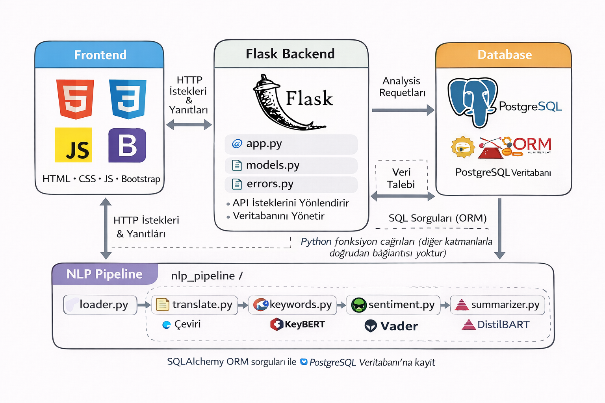

# Metin Analizi Platformu

Bu proje, kullanıcıların girdiği metinler üzerinde doğal dil işleme (NLP) teknikleri uygulayarak
anlamlı ve görselleştirilmiş analizler üreten bir Flask tabanlı web uygulamasıdır.

Kullanıcı tarafından girilen metinler analiz edilir; sonuçlar cümle bazlı ve genel duygu analizi,
anahtar kelimeler ve metin özeti şeklinde sunulur. Analiz çıktıları hem görsel hem de etkileşimli
olarak kullanıcıya gösterilir.

---

## Proje Mimarisi

Aşağıdaki diyagram, uygulamanın katmanlı mimarisini ve bileşenler arasındaki veri akışını göstermektedir:

### Mimari Genel Bakış

- **Frontend**
  - HTML, CSS, JavaScript ve Bootstrap kullanılarak oluşturulmuştur
  - Kullanıcıdan metin alır ve analiz sonuçlarını grafikler ile sunar

- **Flask Backend**
  - HTTP isteklerini karşılar ve yönlendirir
  - NLP pipeline’ını tetikler
  - Veritabanı işlemlerini yönetir
  - SQLAlchemy ORM kullanarak PostgreSQL ile haberleşir

- **NLP Pipeline**
  - Flask backend’den bağımsız bir yapıdadır
  - Metin işleme adımları modüler şekilde ayrılmıştır
  - Diğer katmanlarla doğrudan bağlantısı yoktur

- **Veritabanı (PostgreSQL)**
  - Analiz sonuçları ORM üzerinden kaydedilir
  - Duygu analizleri, anahtar kelimeler ve özet bilgileri saklanır

---

## NLP Pipeline İçeriği

NLP süreci aşağıdaki adımlardan oluşur:

- **Dil tespiti ve çeviri**
  - Gerekli durumlarda metin otomatik olarak İngilizceye çevrilir

- **Cümle bazlı duygu analizi**
  - Her cümle için ayrı ayrı duygu skoru hesaplanır

- **Genel metin duygu analizi**
  - Metnin tamamı için pozitif, negatif ve nötr duygu değerlendirmesi yapılır

- **Anahtar kelime çıkarımı**
  - Metni temsil eden en anlamlı anahtar kelimeler belirlenir

- **Metin özeti**
  - Uzun metinler, anlamı korunarak daha kısa bir özet haline getirilir

---

## Kullanılan Teknolojiler

### Backend
- Python
- Flask
- Flask-SQLAlchemy
- Flask-Migrate
- PostgreSQL

### NLP & Yapay Zeka
- NLTK
- VADER Sentiment Analysis
- KeyBERT
- Hugging Face Transformers (DistilBART)
- Googletrans

### Frontend
- HTML
- CSS
- JavaScript
- Bootstrap

---

## Ortam Değişkenleri

Hassas bilgiler ve yapılandırmalar environment variable kullanılarak yönetilmektedir.
Bu bilgiler repository içerisinde yer almaz.

Gerekli değişkenler:
- `SECRET_KEY`
- `DATABASE_URL`

---

## Notlar

- NLP modelleri repository içerisinde yer almaz.
- Modeller uygulama ilk çalıştığında otomatik olarak indirilir.
- Bu yaklaşım, repository boyutunu küçük tutmak ve deployment süreçlerini sadeleştirmek için tercih edilmiştir.

---

